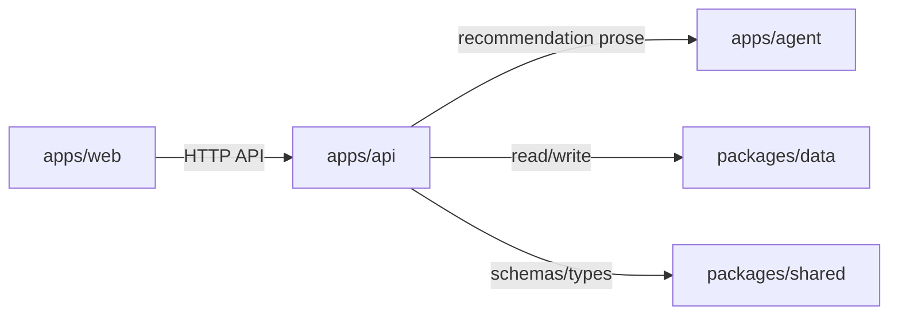

# AICanWinLottery Agent Instructions

This repository uses a Graphify-oriented working style for architecture, dependency, workflow, and impact analysis. Use these instructions alongside any higher-priority system, developer, plugin, or skill guidance.

## Graphify usage

Use the Graphify workflow when the user asks to graphify, map, visualize, diagram, extract a knowledge graph, create Mermaid, explain architecture, or analyze dependencies/impact as a graph.

### Graph quality contract

A good graph output includes:

1. Scope and assumptions.
2. Node and edge legend.
3. Mermaid graph or structured nodes/edges table.
4. File or document evidence for important relationships.
5. Risks, gaps, cycles, bottlenecks, or recommended follow-up graphs.

Prefer evidence-backed graphs over decorative diagrams. Inspect local files before drawing non-trivial repo relationships, and distinguish observed edges from inferred edges.

## Repository graphing defaults

When graphifying this repo:

- Start from `package.json`, `pnpm-workspace.yaml`, app/package manifests, API clients, shared schemas, data stores, tests, and design/planning docs.
- Cluster nodes by runtime boundary first: web app, API service, agent service, shared packages, data/core packages, scripts, tests, and external services.
- Label edges with relationship semantics such as `imports`, `calls`, `persists`, `renders`, `tests`, `generates`, `validates`, or `syncs_with`.
- Keep the first graph readable. Split large graphs into focused subgraphs instead of producing a hairball.

## Mermaid conventions

- Use `flowchart LR` for architecture, dependencies, and impact graphs.
- Use `sequenceDiagram` for request paths.
- Use `stateDiagram-v2` for lifecycle/state-machine behavior.
- Use `erDiagram` for data models.
- Keep node labels short and put explanations below the diagram.

Example:

## Safety and change discipline

- Do not make destructive changes for graph generation.
- Do not implement code from a graph unless the user explicitly asks for implementation.
- For implementation work, preserve existing safety, responsible-use, recommendation, save/check, trace, and data-freshness behavior unless the user explicitly changes scope.
- Verify before claiming completion; use tests, typecheck, build, and source evidence appropriate to the change.
